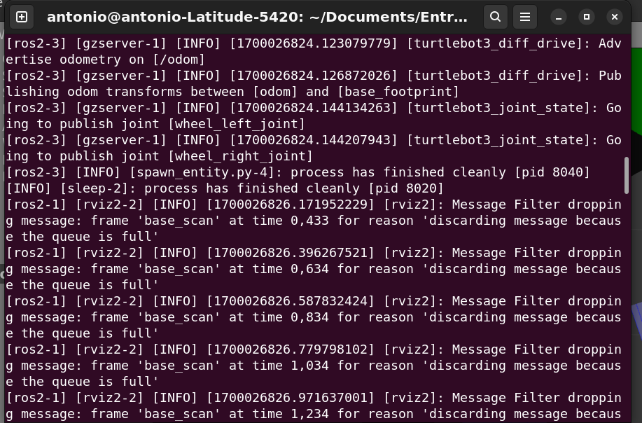

# Ponderada2 

## Tentativa numero 2

O motivo da demora da entrega foi por um erro inexplicavel. Ao rodar o launcher, um erro aparecia falando que não foi possivel encontrar o pacote referente ao launcher e isso me prendeu por alguns dias.

Por isso, decidi criar um novo pacote do zero para ver se o erro persistia. E não é que funcionou?

## Dos processos de criação 

Não entrarei muito afundo nos processos de criação, pois acredito que o código fala por si só. Mas, para resumir, o processo de criação foi o seguinte:

Criação de um pacote. O pacote contempla a função que irá mapear e outra que irá rodar o mapa navegando pelo mesmo.

O laucher pode ser encontrado na pasta launch e o escripe de mapeamento é o mapping_launch. Ele possue um teleop que irá criar um terminal para controlar o robo, o simulador do gazebo e o rviz.

O segundo launcher tambem localizado na pasta launch é o navigation_launch. Ele irá rodar o mapa criado pelo mapping_launch e irá rodar o robo no mapa criado.

## Demostação


Launch de mapeamento

https://github.com/021Antonio/Entregas_Modulo_8/assets/99191811/36ba63b6-5da9-4de2-b488-1a1f09713aec

Launch de operação

https://github.com/021Antonio/Entregas_Modulo_8/assets/99191811/67189b53-3eb8-4b5b-b56d-5efebcf61b07


## Como rodar

Para rodar o projeto, basta rodar o seguinte comando:

```
cd Entregas_Modulo_8/Ponderada2/meu_workspace/src/navegacao/launch
```

Tendo em vista que voce ja esta na pasta do projeto, basta rodar o seguinte comando:

```
cd meu_workspace/src/navegacao/launch
```
Ele ira mandar para a pasta launch que contem os launchers do projeto. Para rodar o projeto, basta rodar o seguinte comando:

```
ros2 launch mapping_launch.py
``` 

Esté comando irá abrir o teleop, o gazebo e o rviz. Ele criara um mapa navegavel para fazer a navegação e mapeamento.
Ao terminar de mapear. Basta salvar o mapa rodando o seguinte comando.


```
ros2 run nav2_map_server map_saver_cli -f <nome-do-mapa>
```
<h3> PS¹: O mapa seŕa salvo dentro da pasta lanch</h3>
<h3> PS²: Voce deve está se perguntando, Porque não usa aquele comando no tutorial que ja roda o launcher direto na hoot? Porque meu computador não ta rodando ;) Na parte debaixo desse readme vai ter uma serie de erros que tive</h3>

Retomando, ao salvar o mapa, basta rodar o seguinte comando:

```
ros2 launch navigation_launch.py
```
Ele **SUPOSTAMENTE** abre o mapa salvo e roda o robo no mapa.

O rvis carrega o mapa salvo, o gazebo simulado o robo e um script que criei/tive ajuda dos meu colegas para controlar o robo.

E pronto. O robo irá navegar pelo mapa.

## Erros

Como dito anteriormente, tive alguns erros que me atrasaram. Irei listar eles aqui para caso alguem tenha o mesmo problema, possa resolver.

<h3>Erro 1</h3>
O primeiro erro foi o seguinte:


Ele dava esse **WARNING** mas acredito que seja mais um erro de caminho do que um erro em si. Eu rodei o colcon na hoot e não apareceu mais isso.

<h3>Erro 2</h3>



Sempre que eu tentava rodar o rviz com com o mapa, ele aparecia isso, tinha horas que eu fechava o terminal e ele ia, horas que eu desligava e ele ia, em alguns momentos ele so ia sozinho mesmo.

<h3>Erro 3</h3>


Esse que foi o que eu comentei sobre rodar o launch na hoot. So desisti mesmo
