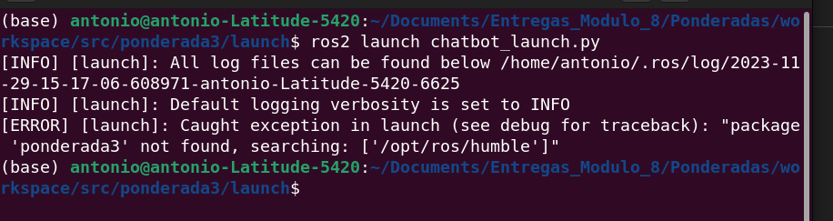

# Ponderada3


## Demostação

https://github.com/021Antonio/Entregas_Modulo_8/assets/99191811/5d8d7dda-f8af-47b0-bff1-0fb0ad29a565


## Como rodar

Para rodar o projeto, basta rodar o seguinte comando:

```
cd Entregas_Modulo_8/Ponderadas/workspace/src

colcon build --packages-select ponderada3

source install/local_setup.bash

```
OKK, mas o que esses codigo fazem?

A primeira linha é para entrar na pasta do projeto.

A segunda linha é para compilar o projeto. 

E a terceira linha é para salvar o que foi copilado.

Pronto, o projeto está compilado. Agora basta rodar o seguinte comando:

```
ros2 run ponderada3 chatbot
``` 

Esté comando irá rodar o chatbot e voce poderá perguntar sobre os materias que temos noo estoque.

## Importante

Quando rodar o projeto, voce terá uma lista de materias que temos no estoque, e voce poderá perguntar sobre eles. Mas caso voce pergunte sobre um material que não temos no estoque, o chatbot irá te responder que não temos esse material.

E a segunda coisa é, foi feita apenas 3 expressões para o chatbot, que são: 

```
    \b[Vv][áa](?:\spara)?\s?[oa]?\s(.+)

    \b(?:[Vv]a)(?:\spara)?(?:\so)?\s(?:objeto)?\s(.+)

    \b(?:[Qq]uero)(?:\sum[a])?\s(.+)
```
Então voce pedir as seguintes coisas:

```
    Vá para o ou a ....

    Vá para o objeto ....

    Quero um ou uma ....
```

Caso tente escrever outra coisa alem disso, ele irá mandar uma mensagem de erro falando que não entendeu.

## Erros



Esse erro acontece quando voce tenta rodar o chatbot com o launcher. 


